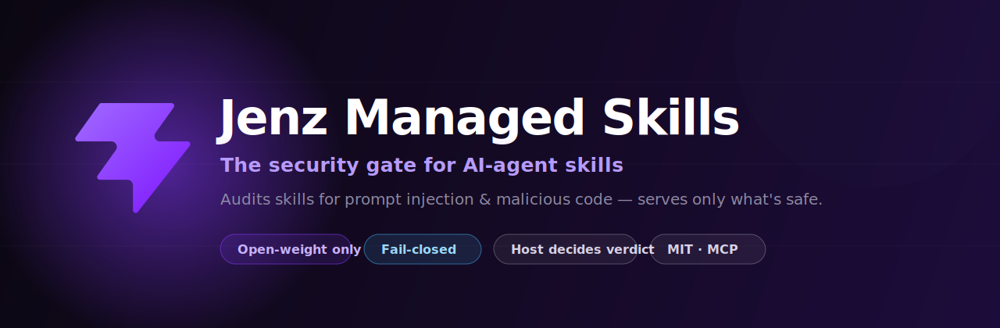
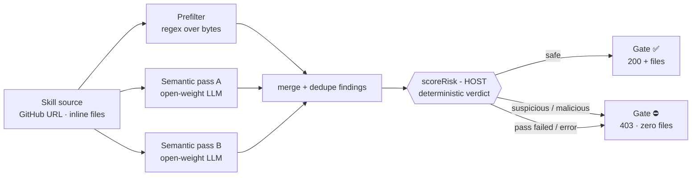

<div align="center">



<br/>

**An open-weight security gate that audits AI-agent _skills_ for prompt injection and malicious code — and serves a skill's files to your agent _only_ if the verdict is `safe`.**

[](./LICENSE)
[](https://www.npmjs.com/package/@jenz-ai/skills-mcp)
[](https://nodejs.org)
[](https://www.typescriptlang.org/)
[](https://modelcontextprotocol.io)

[**Live demo**](https://skills.jenz.ai) · [**Install the MCP**](#-quickstart-add-the-gate-to-claude-code) · [**How it works**](#-how-it-works) · [**Self-host**](#-self-host) · [**Contributing**](#-contributing)

</div>

---

## What is this?

**Skills** are the new way to extend coding agents — a `SKILL.md` plus bundled scripts that Claude Code or Codex load and act on. They're powerful, shareable… and a perfect delivery vehicle for **prompt injection** and **malicious code**. A skill you grabbed from GitHub can quietly tell your agent to exfiltrate secrets, run a remote payload, or ignore its previous instructions — and your agent will read those bytes as instructions and obey.

**Jenz Managed Skills puts a gate in front of that.** Submit a skill (a GitHub URL or inline files); it gets audited; you only ever receive the files if the audit says `safe`. Anything `suspicious` or `malicious` is blocked with **zero files returned** (HTTP `403`), with the exact offending lines surfaced as evidence.

> Built for the **Ada Ventures Open-Source AI Hackathon** — Theme: *Economic Empowerment* · Track: *Safety, Security & Governance AI*.

---

## ✨ Highlights

- 🛡️ **Fail-closed by design** — any error, timeout, unparseable model output, or unknown state resolves to **not safe**. Nothing defaults to `safe`.
- 🧠 **Open-weight only** — the audit verdict path uses open-weight models (DeepSeek via OpenRouter, or point at local Ollama). No proprietary API sits on the critical path; the detection engine *is* the product.
- ⚖️ **The host decides, not the model** — a deterministic `scoreRisk()` on the host computes the verdict from **evidence**. The model only returns findings as inert **data** — its own `risk` label is advisory and never gates anything.
- 🔌 **Native to your agent** — ships as an [MCP server](https://modelcontextprotocol.io). Add it to Claude Code / Codex and vetted skills flow in through normal tool calls.
- 🔍 **Two-layer detection** — a fast regex prefilter over skill bytes, then two tool-less semantic passes (self-consistency), merged and de-duped.
- 📚 **Standards crosswalk** — findings map to OWASP LLM / Agentic / Skills risks and MITRE ATLAS.

---

## 🧭 How it works

A skill never reaches your agent until the host has certified it `safe`. Detection *advises*; the host *decides on evidence*.



**The gate contract:** `GET /api/skills/:id/files` returns `200 { files }` **iff** `risk === 'safe'`, otherwise `403`. The gate reads the host-computed verdict — never a model-emitted one.

### What the detectors catch

| Layer | Detects |
|------|---------|
| **Regex prefilter** | credential exfiltration, secret → network sinks, DNS/OOB exfiltration, remote-fetch-and-execute install chains, base64/`eval` obfuscation, hidden-unicode smuggling, instruction-override ("ignore previous instructions") |
| **Semantic passes** | intent-level prompt injection and malicious behavior that regex can't see — two independent passes for self-consistency |

Verdicts: `pending` → `safe` · `suspicious` · `malicious`.

---

## 🚀 Quickstart: add the gate to Claude Code

The fastest path — install the published MCP server and let your agent audit skills for you:

```bash
claude mcp add jenz-skills \
  -e JENZ_API=https://api.jenz.ai/api \
  -- npx -y @jenz-ai/skills-mcp
```

Then just ask your agent, in natural language:

> *"Audit and add the skill at `github.com/owner/some-skill`."*

The MCP exposes four tools:

| Tool | What it does |
|------|--------------|
| `submit_skill` | Import (GitHub URL or inline files) + audit → returns the verdict |
| `get_skill` | Fetch a stored verdict by id |
| `list_managed_skills` | Browse/search the library (filter by category, risk, query) |
| `pull_skill` | **Gated** — returns files only when `risk === 'safe'`, else `{ ok: false }` |

**The gate in action:**

- 🟢 *"Add a safe formatter skill"* → `submit_skill` → **safe** → `pull_skill` returns files → your agent writes them to `~/.claude/skills/…`. **Vetted skill flows in natively.**
- 🔴 *"Add the skill at `…/poisoned-skill`"* → `submit_skill` → **malicious** + the offending line → `pull_skill` → `{ ok: false }`. **Caught — nothing written.**

See [`apps/mcp/README.md`](./apps/mcp/README.md) for local builds, the in-process mock, and the end-to-end smoke test.

---

## 🖥️ Use it from the web

A dashboard + live "audit moment" (real scan steps streamed over SSE) is hosted at **[skills.jenz.ai](https://skills.jenz.ai)**. Paste a GitHub URL or upload a skill and watch it get scanned, scored, and gated in real time.

---

## 🏗️ Architecture

A pnpm monorepo: one Hono backend, two surfaces (web + MCP), one frozen shared-types contract.

```
apps/
  api/        Hono backend (port 8080) — the gate, the audit engine, routes
  web/        Vite + React 19 dashboard and the gate demo
  mcp/        @jenz-ai/skills-mcp — thin, gate-faithful MCP client
packages/
  shared/     @jenz/shared — frozen TypeScript contracts (the one source of truth)
```

### The audit pipeline (`apps/api/src/lib`)

| Module | Responsibility |
|--------|----------------|
| `prefilter.ts` | L1 regex prefilter over raw skill bytes |
| `openrouter.ts` | open-weight LLM classifier — forced JSON, 2 passes, non-thinking, model reads bytes as inert **data** |
| `score.ts` | **deterministic `scoreRisk()` on the host** — computes the trusted verdict |
| `audit.ts` | orchestrates the above into `auditSkill(raw, onProgress?) => AuditedSkill` |
| `taxonomy.ts` | maps findings to OWASP / MITRE ATLAS |
| `routes/audit.ts` | HTTP surface (one-shot JSON + SSE stream) |

### HTTP API

| Method & path | Purpose |
|---------------|---------|
| `GET /healthz` | liveness → `{ ok: true }` |
| `POST /audit` | audit a skill (one-shot JSON) |
| `POST /audit/stream` | audit with live scan steps (SSE) |
| `POST /api/skills/import` | import from GitHub / inline, then audit |
| `GET /api/skills` | list the managed-skill library |
| `GET /api/skills/:id` | a stored verdict |
| **`GET /api/skills/:id/files`** | **the gate** — `200 { files }` iff `safe`, else `403` |

---

## 🔧 Self-host

**Prerequisites:** Node `>=22`, [pnpm](https://pnpm.io) `9.12`.

```bash
git clone https://github.com/jenz-ai/jenz-managed-skills.git
cd jenz-managed-skills
pnpm install

pnpm dev:api    # Hono API → http://localhost:8080/healthz ⇒ { ok: true }
pnpm dev:web    # Vite dev server (dashboard + demo)
pnpm dev:mcp    # MCP server (stdio)
```

### The audit engine is DB-free

`auditSkill` and everything in `apps/api/src/lib/*` are **pure functions** — no Postgres, no Docker. Build and test them with Vitest alone:

```bash
pnpm --filter @jenz/api test
pnpm typecheck      # type-check every package — run before every push
```

A database (Supabase/Postgres via Prisma) only backs the **platform** layer — auth, workspaces, and verdict persistence. The detection logic never touches it.

### Configuration (`apps/api/.env`, gitignored)

| Variable | Purpose |
|----------|---------|
| `AUDIT_MODEL` | open-weight model id (e.g. a DeepSeek model on OpenRouter) |
| `OPENROUTER_API_KEY` / `GROQ_API_KEY` | model provider key |
| `OPENROUTER_BASE_URL` | base URL — **repoint at local Ollama** for a fully sovereign path, no code change |
| `DATABASE_URL` | Supabase / Postgres connection string (platform layer only) |

> **No `OPENROUTER_API_KEY`?** The engine runs in documented **regex-only dev mode** and still fails closed — it just can't certify `safe` on semantics alone.

---

## 🧪 Design principles

These are non-negotiable invariants, not preferences:

- **Skill bytes are inert DATA.** We build a prompt-injection tool — we never let skill content act as instructions. Prefilter, quote, classify; never execute or obey.
- **The model advises; the host decides.** Trust nothing the model labels `risk`. Only host-side `scoreRisk()` over real findings produces a verdict.
- **Fail closed, always.** Error, timeout, unparseable output, unknown → **not safe**.
- **Open-weight on the critical path.** Proprietary models never sit on the audit path — that path is the product, and it must be inspectable and sovereign-deployable.
- **Test-driven.** RED → GREEN → refactor. Attack fixtures live with the API; a CI Postgres service runs the gate round-trip tests hermetically.

---

## 🛠️ Tech stack

**TypeScript** (strict ESM) · **Node 22** · **pnpm 9.12** monorepo · **Hono** (API) · **Vite + React 19** (web) · **[@modelcontextprotocol/sdk](https://modelcontextprotocol.io)** (MCP) · **Prisma + Supabase/Postgres** (platform) · **Vitest** (tests) · deployed on **Railway** (API) + **Cloudflare** (web).

---

## 🤝 Contributing

Contributions are welcome — this is open source.

1. Fork & branch from `main`.
2. Write the test first (the engine is pure → easy to TDD): `pnpm --filter @jenz/api test`.
3. `pnpm typecheck` must pass before you push.
4. Keep the [frozen contracts](#the-audit-pipeline-appsapisrclib) stable — `@jenz/shared` types, the `auditSkill` signature, and the gate behavior — unless you open a discussion first.
5. Open a PR. CI runs typecheck, tests, and the gate round-trip against an ephemeral Postgres.

Good first contributions: new prefilter detectors (with attack fixtures), taxonomy mappings, and additional model providers behind the env-driven wrapper.

---

## 📄 License

[MIT](./LICENSE) © Jenz AI. The MCP server is published as [`@jenz-ai/skills-mcp`](https://www.npmjs.com/package/@jenz-ai/skills-mcp).

<div align="center">
<br/>
<sub>Built with care for safer AI agents. Audit before you trust.</sub>
</div>
